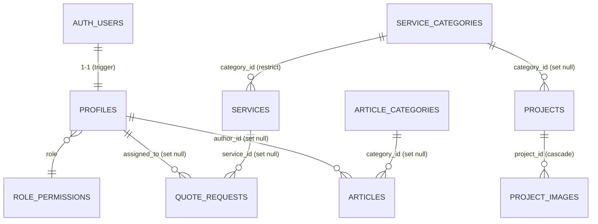

# Architecture & modèle de données

## 1. Analyse du besoin

UPCOM AGENCY & SERVICES doit pouvoir, depuis un back-office :

| Besoin | Réponse backend |
|---|---|
| Présenter ses 6 pôles d'activité et ses services | `service_categories` (données de référence) + `services` |
| Valoriser ses réalisations (galeries) | `projects` + `project_images` |
| Publier actualités et événements | `articles` (+ `article_categories`), `events` |
| Présenter l'équipe et des témoignages | `team_members`, `testimonials` |
| Recevoir des demandes commerciales | `quote_requests`, `contact_messages` via Edge Functions |
| Gérer les infos globales du site | `site_settings` (singleton), `social_links` |
| Donner des droits différents selon le métier | `profiles.role` + `role_permissions` + RLS |

Contraintes structurantes : sécurité appliquée **en base** (RLS), un seul projet Supabase partagé
par 3 dépôts, aucune donnée officielle inventée.

## 2. Architecture

```
                         ┌──────────────────── Supabase (1 projet) ────────────────────┐
 upcom-frontend ──anon──▶│ PostgREST ──▶ PostgreSQL (RLS)                               │
  (site public)          │ Storage (buckets publics en lecture)                         │
        │                │ Edge Functions ──service_role──▶ PostgreSQL                  │
        └──── POST ─────▶│   submit-quote-request / submit-contact-message ──▶ Resend   │
                         │   send-*-notification (webhook / back-office)                │
 upcom-admin ──JWT──────▶│ Auth (invitation uniquement) · admin-invite-user             │
  (back-office)          └──────────────────────────────────────────────────────────────┘
                                      ▲
 upcom-backend (ce dépôt) ────────────┘ migrations · seed · tests · functions · types npm
```

Principes :

1. **La base est la source de vérité de la sécurité.** Chaque table a la RLS activée ; les policies
   s'appuient sur des *permissions* (pas des rôles), via `private.has_permission()`.
2. **Aucune écriture anonyme directe.** Le site public ne fait que des `SELECT` ; les formulaires
   passent par des Edge Functions (validation, anti-spam) qui écrivent avec la `service_role`.
3. **La `service_role` ne quitte jamais le serveur** (Edge Functions uniquement, injectée par la plateforme).
4. **Types générés, jamais recopiés** : `src/database.types.ts` est généré depuis le schéma et publié
   dans le package `@upcom/supabase`.

## 3. Modèle de données



Tables sans relation : `events`, `team_members`, `testimonials`, `contact_messages`,
`site_settings`, `social_links`.

### Conventions communes

| Convention | Détail |
|---|---|
| Clés | `id uuid default gen_random_uuid()` (sauf `site_settings.id = 1`, `profiles.id = auth.users.id`) |
| Horodatage | `created_at`, `updated_at` (trigger `private.set_updated_at`) |
| Slug | unique, `^[a-z0-9]+(-[a-z0-9]+)*$`, **généré automatiquement** depuis le titre s'il est omis (gestion des accents et des doublons : `ete-special`, `ete-special-2`) |
| Statut éditorial | enum `content_status` : `draft` · `published` · `archived` |
| Ordre / mise en avant | `display_order integer`, `is_featured boolean` |
| Images | colonnes `*_path` = **chemin dans le bucket**, pas une URL (portable entre environnements). URL via `getPublicStorageUrl()` du package |
| Intégrité | contraintes `CHECK` (longueurs, formats e-mail / téléphone / URL https, dates cohérentes) |

### Choix notables

- **`service_categories` = données de référence** : les 6 pôles du cahier des charges sont insérés par
  migration (donc présents en production), descriptions volontairement vides.
- **`projects.category_id`** réutilise les pôles de service : une réalisation se classe par métier.
- **`articles.published_at`** : rempli automatiquement à la publication ; une date future
  programme l'article (invisible publiquement jusque-là).
- **`articles.author_name`** : signature publique ; `author_id` (profil interne) n'est jamais exposé
  au public, les profils n'étant pas lisibles par les visiteurs.
- **`site_settings` singleton typé** plutôt qu'un clé/valeur : types TS précis, validation SQL par colonne.
  Contient les informations officielles (nom, adresse, téléphones) ; les champs inconnus restent `NULL`.
- **Demandes (`quote_requests`, `contact_messages`)** : `ip_hash` (SHA-256 salé, jamais l'IP en clair)
  pour le rate-limit, `notified_at` pour l'idempotence des e-mails, `internal_notes` / `assigned_to`
  pour le suivi commercial.

### Index

Chaque clé étrangère est indexée. Index composites pour les listings publics
(`status, display_order`), (`status, published_at desc`), (`status, event_date desc`),
index partiels pour les éléments mis en avant, et (`ip_hash, created_at desc`) pour le rate-limit.

## 4. Migrations

| Fichier | Contenu |
|---|---|
| `…120000_foundation` | schéma `private`, enums, triggers utilitaires (updated_at, slug, published_at) |
| `…120100_auth_profiles_permissions` | `profiles`, `role_permissions`, helpers RLS, RPC `get_my_access`, triggers Auth |
| `…120200_services_catalog` | `service_categories` (+ 6 pôles officiels), `services` |
| `…120300_portfolio` | `projects`, `project_images` |
| `…120400_editorial` | `article_categories`, `articles`, `events` |
| `…120500_team_testimonials` | `team_members`, `testimonials` |
| `…120600_leads` | `quote_requests`, `contact_messages`, privilèges par colonne |
| `…120700_site_settings` | `site_settings` (+ infos officielles), `social_links` |
| `…120800_storage` | buckets + policies `storage.objects` |
| `…120900_hardening` | retrait des privilèges inutiles (anon en lecture seule, pas de TRUNCATE) |

Chaque migration d'une table contient ses index, triggers et policies RLS : une table n'existe
jamais sans sa sécurité.
